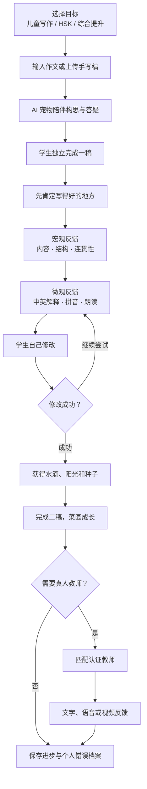
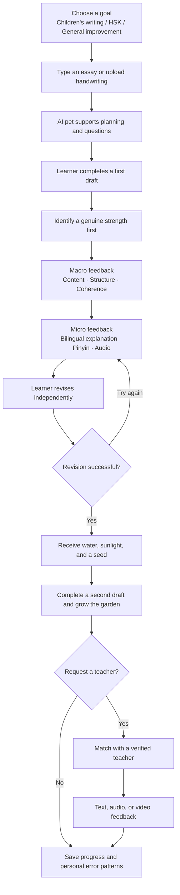
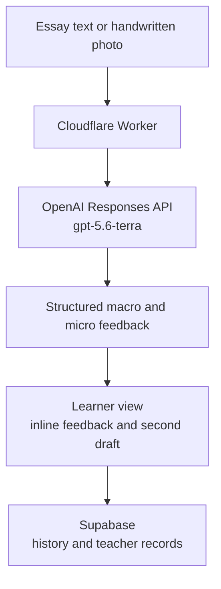

# 红笔 HongBi — AI + 专业教师华文写作平台

> 让孩子把学过的中文，真正写出来。  
> Helping learners turn the Chinese they know into writing they can be proud of.

[在线体验 Live demo](https://gracetang0925.github.io/hongbi/) · [中文产品愿景](#中文产品愿景) · [English vision](#english-product-vision)


红笔面向全球华文二语学习者，特别关注 **6–12 岁、家庭中缺少华文环境的儿童**，以及准备 HSK 或希望系统提升中文写作的学习者。产品把 AI 即时反馈、双语解释、拼音与朗读、逐步修改、成长奖励和全球认证教师服务连接在同一条学习路径中。

HongBi is designed for Chinese-as-a-second-language learners worldwide—especially children ages 6–12 with little Chinese support at home, as well as HSK and writing-improvement learners. It brings AI feedback, bilingual explanations, pinyin and audio, guided revision, meaningful rewards, and verified teacher support into one learning journey.

> [!IMPORTANT]
> 本 README 同时记录当前原型和下一阶段产品愿景。标记为“规划中”的功能尚未全部上线。  
> This README covers both the current prototype and the next-stage vision. Features marked “planned” are not all available yet.

## 当前原型 / Current prototype

| 已上线能力 | Available today |
|---|---|
| 输入中文作文或上传手写稿 | Type an essay or upload a handwritten draft |
| AI、教师式、人机协同三种反馈方式 | AI, teacher-style, and hybrid feedback modes |
| 宏观反馈：内容、结构、连贯性 | Macro feedback: content, structure, coherence |
| 微观反馈：原文、修改建议、错误类型、原因 | Micro feedback: span, correction, category, explanation |
| 一稿与二稿反馈 | First- and second-draft feedback |
| 教师端学习记录与错误观察 | Teacher-side learning records and error review |

当前技术栈：OpenAI Responses API（`gpt-5.6-terra`）· Cloudflare Workers · Supabase/Postgres · 原生 HTML/CSS/JavaScript。

Current stack: OpenAI Responses API (`gpt-5.6-terra`) · Cloudflare Workers · Supabase/Postgres · vanilla HTML/CSS/JavaScript.

---

# 中文产品愿景

## 一句话定位

**红笔是一款面向全球华文二语学习者的 AI + 专业教师写作学习平台。**

写作是二语学习中最复杂的主动输出任务之一。学习者需要同时处理汉字、拼音、词汇、语序、量词、“了/过/着”等体标记、书面语体、内容组织与篇章连贯。红笔希望帮助学习者完成从“看得懂中文”到“用中文表达自己”的跨越。

## 目标用户

### 儿童华文二语学习者

- 主要年龄为 6–12 岁
- 英语或其他语言是主要家庭语言
- 家中缺少稳定的华文环境
- 需要中英文解释、拼音、朗读和鼓励式反馈
- 使用场景包括中文学校、家庭作业和日常写作练习

### HSK 与写作提升学习者

- 正在准备 HSK 或其他中文考试
- 希望系统训练文章结构和语言准确性
- 需要理解常见失分原因和自己的错误模式
- 希望通过一稿、反馈、二稿建立持续进步记录

儿童成长模式默认不评分；HSK 模拟考试模式可以由学习者主动开启评分和考试分析。

## 1. AI 宠物陪写，而不是代写

学生写作文时，AI 学习宠物会出现在写作区旁边，帮助孩子思考，但不替孩子完成作文。

宠物可以回答生词和语法问题、显示拼音、朗读句子、用英文解释中文规则、提供小提示，并在修改成功后给予具体鼓励。如果学生要求代写，宠物会用问题引导学生自己构思。


## 2. 看懂错误原因，再自己修改

对于家庭中没有华文环境的学习者，每条反馈可以包含：

1. 中文与英文错误类型
2. 原文片段
3. 建议修改
4. 一句简单中文解释
5. 一句英文解释
6. 拼音
7. 简单例句
8. 原句与修改后句子的朗读

儿童模式不以总分制造压力。系统先指出真正写得好的地方，再优先展示 3–5 个最值得修改的问题，引导孩子完成：

```text
发现问题 → 理解原因 → 尝试修改 → 验证修改 → 获得具体鼓励
```


## 3. 宏观与微观两层反馈

1. **宏观反馈：** 内容、结构和连贯性
2. **微观反馈：** 语序、量词、体标记、语体、搭配和具体语言问题

学习者先理解文章整体，再逐句修改，不会被零散错误淹没。写对了，系统说明为什么写得好；写错了，系统指出问题位置和原因；修改成功后，让孩子明确感受到自己学会了什么。

## 4. 全球认证教师网络

红笔计划建立经过认证和质量控制的全球华文教师网络。学生可以选择 AI 即时反馈、认证教师批改，或 AI 先分析、教师再重点指导的人机协同服务。

教师可在结构化工作台提供：

- **文字反馈：** 标记原文、说明原因、提供建议
- **语音反馈：** 讲解句子、示范发音、给予鼓励
- **视频反馈：** 总结文章结构和重点问题

平台可为语音和视频自动生成字幕与双语文本。早期优先支持异步反馈，不开放教师与儿童之间的私人视频通话。


### 教师质量等级

| 等级 | 质量机制 |
|---|---|
| 实习批改员 | 完成培训与模拟测试；反馈必须由资深导师审核 |
| 认证教师 | 完成身份、资质与平台标准验证；接受随机质量抽查 |
| 资深导师 | 审核实习教师反馈，处理复杂作文与质量申诉 |

## 5. 写作菜园与成长奖励

奖励与真实学习行为绑定，而不是奖励“错误最少的人”。

| 学习行为 | 菜园奖励 |
|---|---|
| 完成一稿 | 获得一颗种子 |
| 阅读错误解释 | 获得一滴水 |
| 自己修改一句 | 获得阳光或肥料 |
| 完成二稿 | 蔬菜成熟 |
| 同类错误下一次写对 | 获得稀有种子或徽章 |

未来可加入安全、低冲突的好友互动：帮好友浇水、访问好友菜园、友情采摘少量虚拟菜叶。原主人不会失去主要收获；家长可以关闭社交功能；儿童之间不开放陌生人私聊。


## 产品流程



## 会员设想

> 以下价格是产品假设，仍需要通过早期用户测试验证。

### 学生成长会员 — $29.90/月

计划包含 AI 写作练习、双语解释、拼音与朗读、一稿二稿对比、个人错误档案、儿童或 HSK 学习路径，以及每月一定数量的认证教师批改额度。前三个月免费更适合作为限量“创始用户测试计划”；真人教师服务需设置合理赠送次数，以控制真实人力成本。

### 教师专业会员 — $9.90/月

教师基础注册与实习阶段建议免费。可选专业会员可提供 AI 批改助手、结构化反馈模板、语音/视频字幕、学生错误整理、教师主页、专业培训、认证工具，以及更低平台服务费或优先订单匹配。教师购买的是效率工具与职业成长服务，而不是单纯购买接单资格。

## 儿童安全原则

- 最小化向教师展示的儿童真实身份信息
- 家长可以查看全部反馈和消息
- 不允许师生交换私人联系方式
- 自动提醒或隐藏作文中的学校、地址和联系方式
- 保留文字、语音和视频反馈审核记录
- 实习教师的反馈必须经过导师审核
- 好友菜园不显示学校、位置等敏感信息
- 家长可以关闭社交和游戏化功能
- 奖励学习行为，不使用制造焦虑的限时抢收机制

---

# English product vision

## Positioning

**HongBi is an AI-plus-teacher writing platform for learners of Chinese as a second language worldwide.**

Writing is one of the hardest forms of active output in second-language learning. A learner must coordinate characters, vocabulary, word order, measure words, aspect markers, register, organization, and coherence at the same time. HongBi helps learners move from **understanding Chinese** to **expressing themselves in Chinese**.

## Target learners

### Children learning Chinese as a second language

- Primarily ages 6–12
- English or another language is dominant at home
- Limited access to Chinese-speaking support outside class
- Need bilingual explanations, pinyin, audio, and encouraging feedback
- Common use cases include homework, weekend Chinese school, and independent practice

### HSK and writing-improvement learners

- Preparing for HSK or another Chinese-language examination
- Need structured practice and clear explanations of likely lost points
- Want to track recurring error patterns and progress across drafts

Children's growth mode is score-free by default. HSK learners may explicitly enable exam simulation, scoring, and test-oriented analysis.

## The planned learning experience

### 1. An AI pet that supports thinking—not ghostwriting

The learning pet stays beside the writing area. It can explain vocabulary and grammar, show pinyin, play pronunciation, offer English support, ask planning questions, point to an issue, and celebrate a successful revision. If a learner asks for a complete essay, the pet guides the learner with questions instead of producing the submission.

### 2. Bilingual, pinyin, and audio scaffolding

Each feedback item may contain the error category in Chinese and English, the original span, a suggested revision, short explanations in simple Chinese and English, pinyin, an example, and audio for the original and revised sentence. Pinyin is progressive: on by default for beginners, available on tap for intermediate learners, and hidden by default for advanced learners.

### 3. Feedback without score pressure

The children's mode first identifies a genuine strength, then surfaces only the three to five most useful revision priorities. The learner discovers the problem, understands the reason, attempts a revision, checks it, and receives specific encouragement.

HongBi preserves two feedback layers:

1. **Macro:** content, structure, and coherence
2. **Micro:** word order, measure words, aspect markers, register, collocation, and precise language issues

### 4. A verified global teacher network

Learners may choose instant AI feedback, a verified teacher review, or AI–teacher collaboration. Teachers can provide structured text, asynchronous audio, or video feedback. Audio and video may be transcribed and shown with bilingual subtitles. The network begins invite-only and uses trainee, verified-teacher, and senior-mentor levels for quality control.

### 5. A writing garden tied to real learning

Completing a first draft earns a seed; reading an explanation earns water; revising independently earns sunlight or fertilizer; completing a second draft grows a vegetable; and correctly using a previously difficult form may unlock a rare seed or badge. Any future friend-garden experience will include parent controls, privacy safeguards, and no private messaging with strangers.

## Product flow



## Membership hypotheses

- **Learner Growth — $29.90/month:** planned AI practice, bilingual explanations, pinyin and audio, draft comparison, progress tracking, a children's or HSK path, and a defined teacher-review allowance. A three-month free period is best tested as a limited founding-user pilot.
- **Teacher Pro — $9.90/month:** an optional workflow and professional-growth plan with an AI review assistant, structured rubrics, transcription, learner-error analytics, a professional profile, training, and certification tools. Basic registration and the trainee stage should remain free.

## Child safety and quality

HongBi minimizes personal information, gives parents visibility, prevents teachers and children from exchanging private contact details, flags sensitive information in essays, keeps auditable feedback records, requires mentor approval for trainee reviews, and lets parents disable social or gamified features.

---

## Roadmap / 路线图

### Phase 1 — Bilingual AI writing coach / 双语 AI 写作教练

- [ ] AI 宠物陪写 / AI pet writing companion
- [ ] 中英文错误解释 / bilingual explanations
- [ ] 拼音与朗读 / pinyin and pronunciation
- [ ] 不评分的逐条修改 / score-free guided revision
- [ ] 具体鼓励与写作菜园 / specific praise and a writing garden

### Phase 2 — Human teacher pilot / 真人教师试点

- [ ] 邀请制认证教师网络 / invite-only verified teachers
- [ ] 结构化文字与异步语音反馈 / structured text and asynchronous audio
- [ ] 自动字幕和双语文本 / automatic transcripts and bilingual text
- [ ] 一稿、二稿与教师反馈历史 / draft and teacher-feedback history

### Phase 3 — Teacher platform and community / 教师平台与学习社区

- [ ] 实习教师与导师审核 / trainee and mentor review
- [ ] 教师视频反馈 / teacher video feedback
- [ ] 教师专业会员 / Teacher Pro
- [ ] 好友菜园与家长控制 / friend gardens and parent controls

### Phase 4 — Global and HSK expansion / 全球化与 HSK 深度训练

- [ ] HSK 分级写作路径 / level-specific HSK writing paths
- [ ] 简体与繁体 / Simplified and Traditional Chinese
- [ ] 多家庭语言解释 / additional home languages
- [ ] 多时区教师匹配 / multi-time-zone matching
- [ ] 学校与教育机构版本 / school and program plans

## Research foundation / 研究基础

HongBi's feedback design is informed by Grace Tang's M.A. thesis research at NTU Singapore: a three-group experimental study comparing AI-only, teacher-only, and human–AI collaborative feedback on second-language Chinese writing. The work informed a dual-layer scaffolding framework for sequencing macro and micro feedback.

红笔的反馈设计源于 Grace Tang 在新加坡南洋理工大学的硕士论文研究：通过三组实验比较 AI、教师与人机协同对华文二语写作的反馈效果，并由此形成宏观与微观双层反馈框架。

An earlier Claude-based research prototype is available at [`chinese-writing-feedback`](https://github.com/gracetang0925/chinese-writing-feedback). This repository is the OpenAI-based rebuild.

## How the current prototype works / 当前原型技术流程



## Running and deployment / 本地运行与部署

1. Clone this repository.
2. In Cloudflare, create or open the Worker used by the learner page.
3. Add the OpenAI API key as an encrypted Worker secret named `OPENAI_API_KEY`—never place the key in source code.
4. Deploy `worker.js` while keeping the existing Worker route used by `index.html`.
5. Publish the repository with GitHub Pages and open `index.html` for the learner view or `teacher.html` for the teacher dashboard.

With Wrangler, the secret can be set using:

```bash
wrangler secret put OPENAI_API_KEY
```

## Product demo video / 产品演示视频

产品演示视频将在主要功能完成后，使用真实产品操作流程进行录制。  
The product demo video will be recorded after the planned product experience has been implemented.

## About / 关于

Grace Tang is a Chinese-language educator and M.A. student in International Chinese Language Education at NTU Singapore. HongBi grows from hands-on teaching experience, thousands of reviewed essays, and a belief that feedback should help every learner understand not only *what* to change, but *why*.

## License

MIT
