# 红笔 HongBi — AI + 专业教师华文写作平台

> 让孩子把学过的中文，真正写出来。  
> Helping learners turn the Chinese they know into writing they can be proud of.

[在线体验 Live demo](https://gracetang0925.github.io/hongbi/) · [学生端 Learner view](https://gracetang0925.github.io/hongbi/) · [教师端 Teacher view](https://gracetang0925.github.io/hongbi/teacher.html) · [学生端演示视频 Learner demo video](#学生端演示视频--learner-demo-video)

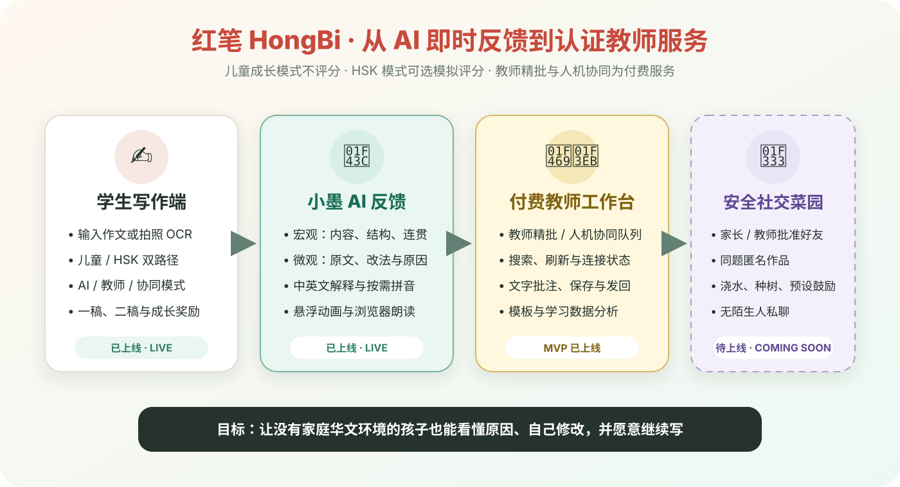

红笔面向全球华文二语学习者，重点服务 **6–12 岁、家庭中缺少华文环境的儿童**，以及准备 HSK 或希望系统提升中文写作的学习者。产品把 AI 即时反馈、中英文解释、按需拼音、逐步修改、成长奖励和全球认证教师服务连接在同一条学习路径中。

HongBi is designed for Chinese-as-a-second-language learners worldwide—especially children ages 6–12 with little Chinese support at home, plus HSK and writing-improvement learners. It combines instant AI feedback, bilingual explanations, on-demand pinyin, guided revision, meaningful rewards, and verified teacher support.

> [!IMPORTANT]
> 本 README 同时记录当前 MVP 和产品愿景。标注为“待上线 / Coming soon”的功能尚未开放；示意图用于说明产品方向，不代表功能已经完成。

## 当前 MVP / Current MVP

| 已实现 / Implemented | 学习价值 / Learner value |
|---|---|
| 输入作文或拍照识别手写稿 / Type or scan handwriting | 保留 OCR 写作入口 / Keeps the handwriting workflow |
| AI 即时反馈，以及标有“付费”的教师精批、人机协同入口 / Free AI feedback plus clearly labelled paid teacher and hybrid options | 先体验 AI，再按需选择真人服务 / Try AI first, then add human support when needed |
| 宏观反馈：内容、结构、连贯性 / Macro feedback | 先看文章整体 / Revise the whole text first |
| 微观反馈：语序、量词、了/过/着、语体、搭配 / Micro feedback | 找到具体可修改的问题 / Identify actionable issues |
| 简单中文 + 英文原因 / Simple Chinese + English reasons | 没有家庭华文支持也能理解 / Works without Chinese support at home |
| 按需显示拼音 / On-demand pinyin | 需要时获得支架，不让页面过载 / Support without visual overload |
| 具体表扬与小墨提示 / Specific praise and pet hints | 说明哪里写得好，也说明为什么 / Explains what worked and why |
| 儿童成长模式默认不评分 / Score-free child mode | 降低焦虑，专注理解与修改 / Reduces anxiety and supports revision |
| HSK 备考模式主动开启 AI 模拟评分 / Optional HSK simulation | 有考试目标时查看练习分数 / Practice scoring when the learner chooses it |
| 本地种子与水滴奖励 / Local seed and water rewards | 奖励完成、阅读与修改行为 / Rewards learning behaviors |
| 一稿、二稿与 Supabase 记录 / Draft history and Supabase records | 观察长期进步 / Tracks progress over time |
| 会动的小墨与点击朗读 / Animated Xiao Mo with click-to-speak | 用儿童友好的方式陪伴阅读反馈 / Makes feedback easier and friendlier to read |
| 教师端文字批改队列 / Teacher text-review queue | 搜索、刷新、状态提示、批注、模板、保存与发回 / Search, refresh, annotate, save, and return work |

当前技术栈：OpenAI Responses API（`gpt-5.6-terra`）· Cloudflare Workers · Supabase/Postgres · 原生 HTML/CSS/JavaScript。

Current stack: OpenAI Responses API (`gpt-5.6-terra`) · Cloudflare Workers · Supabase/Postgres · vanilla HTML/CSS/JavaScript.

## 学生端演示 / Learner demo

### 儿童成长模式：默认不显示分数

Child growth mode is selected by default. It focuses on understanding, revising, and encouragement—without a total score.

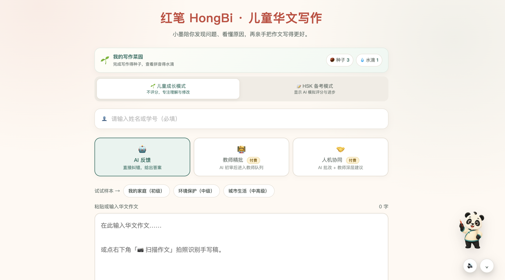

### HSK 备考模式：学习者主动开启模拟评分

HSK learners can explicitly switch modes to see AI-simulated practice scores and progress. The interface states that these are **not official HSK results**.

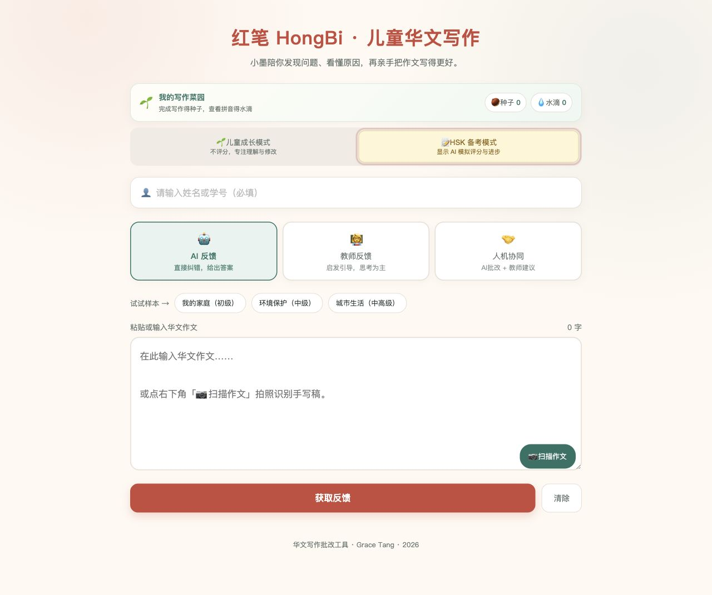

### 双语反馈与 AI 宠物

每条重点问题包含原文、建议修改、简单中文原因、简短英文原因、按需拼音和“小墨”提示。系统先指出真正写得好的地方，再展示 3–5 个最值得修改的问题。

Each priority issue contains the original span, a suggested correction, simple Chinese, short English, on-demand pinyin, and a hint from Xiao Mo. HongBi identifies a genuine strength before surfacing three to five useful revision priorities.

小墨目前会在页面右侧轻轻活动；学生点击语音按钮后，可使用浏览器的朗读功能听反馈。受浏览器自动播放规则影响，首次朗读需要学生主动点击。

Xiao Mo currently animates beside the page. After the learner taps the audio button, browser-native speech reads the feedback aloud. The first playback requires a user gesture because of browser autoplay rules.

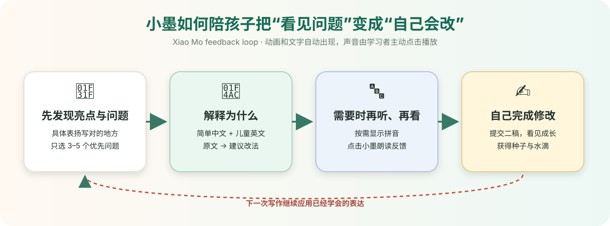

## 学习流程 / Learning flow

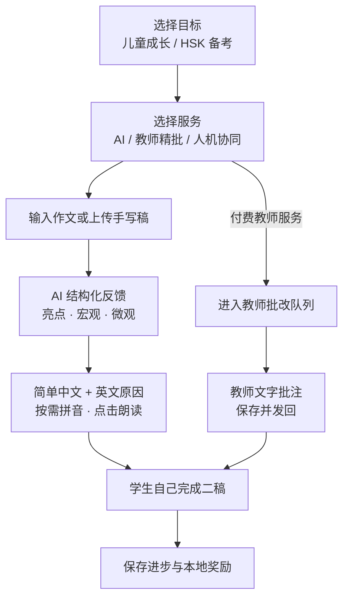

儿童模式不以“错误最少”作为奖励标准：完成一稿获得种子，打开拼音获得水滴，完成二稿获得更多成长资源。未来的菜园社交只考虑帮助浇水、访问和低冲突互动，不开放陌生人私聊。

Child mode rewards completion, reading support, and revision—not being the learner with the fewest errors. Future garden social features will remain parent-controlled and will not include private messaging with strangers.

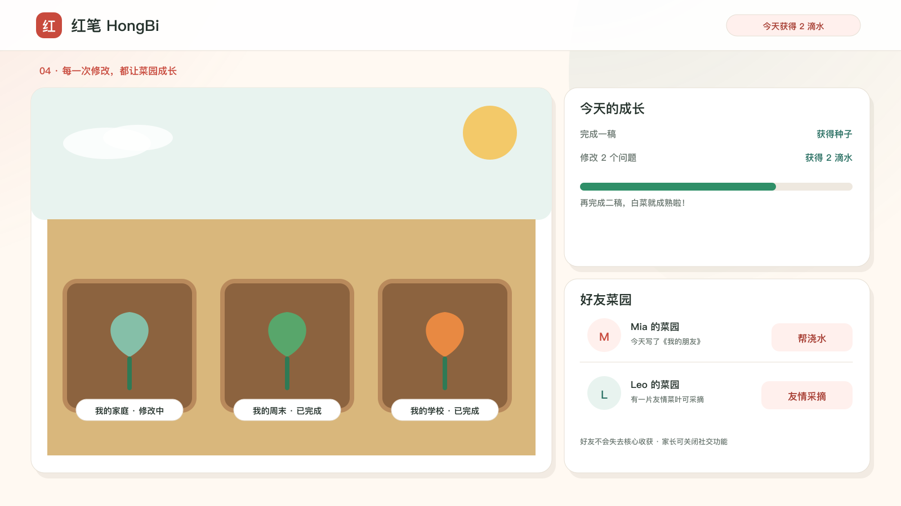

## 小墨农场社交愿景（待上线）/ Xiao Mo Farm social vision (Coming soon)

> **待上线 / Coming soon.** 当前 MVP 只有保存在本机的种子和水滴；好友农场、同题作品、帮助浇水、共同种树和安全留言尚未开放。  
> The current MVP only stores seeds and water locally. Friend gardens, same-topic writing, helpful watering, shared planting, and safe messages are not live yet.

小墨农场把写作进步变成可以看见的成长，但不以“错误最少”或公开分数制造竞争。完成写作、查看拼音、理解错误原因和完成二稿都会触发类似语言学习应用的胜利页面，展示连续学习天数、获得的水滴或种子，以及植物的新变化。

Xiao Mo Farm turns writing progress into visible growth without ranking children by errors or public scores. Completing a draft, opening pinyin, understanding an explanation, or finishing a revision triggers a celebratory completion screen with streaks, earned items, and visible plant growth.

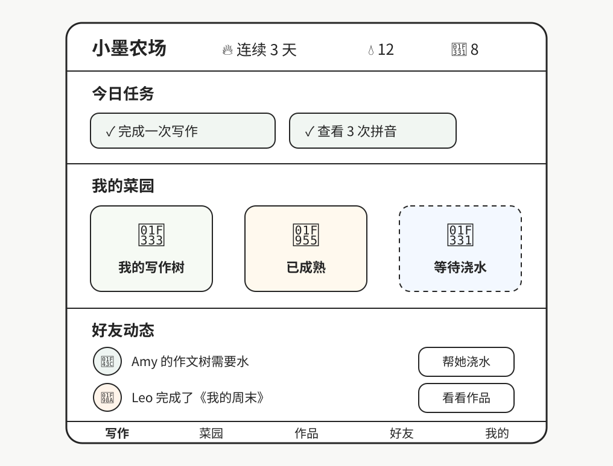

### 学习行为与奖励 / Learning actions and rewards

| 学习行为 / Learning action | 农场反馈 / Farm response |
|---|---|
| 完成一稿 / Complete a first draft | 获得种子并出现胜利动画 / Earn a seed and see a celebration |
| 查看拼音 / Open pinyin support | 获得水滴 / Earn water |
| 阅读错误原因 / Read an explanation | 获得阳光或经验 / Earn sunlight or learning XP |
| 自己完成二稿 / Complete a revision | 植物成长或成熟 / Grow or harvest a plant |
| 同类问题下一次写对 / Correct a recurring pattern | 解锁稀有植物、树木或徽章 / Unlock a rare plant, tree, or badge |
| 帮好友浇水 / Water a friend's plant | 双方获得少量友情成长值 / Both learners receive a small friendship reward |

### 受控的儿童社交 / Child-safe social design

- 好友通过家长、教师或班级邀请码确认，不开放陌生人搜索。
- 同题作品按年龄、中文水平和主题分类，并只展示经过授权和去身份化的内容。
- 第一阶段留言只使用预设鼓励语和表情，例如“写得很清楚”“我也喜欢这个故事”“继续加油”。
- 不开放陌生人私聊，也不显示真实姓名、学校、位置或联系方式。
- “友情采摘”不会减少原主人的收获；家长可以关闭作品分享和全部社交功能。
- Friends are approved through a parent, teacher, or classroom invite code; stranger search is disabled.
- Same-topic writing is grouped by age, language level, and prompt, and is shown only with permission and identifying details removed.
- Early messages use preset encouragement and reactions rather than unrestricted free text.
- No stranger direct messages, public schools, locations, contact details, or loss-based stealing mechanics.

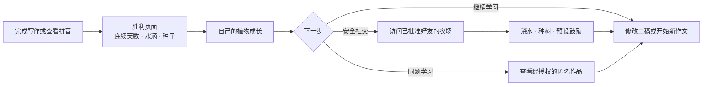

## 教师端 MVP 与待上线愿景 / Teacher MVP and coming-soon vision

教师端已具备可试用的付费文字批改流程：付费作文进入待批改队列，教师可查看连接状态、搜索和刷新作文，使用文字批注与评语模板，保存草稿并把反馈发回学生。当前登录仅为 MVP 访问门槛，不是正式账号系统。

The teacher MVP now supports a testable paid text-review workflow: paid submissions enter a queue, teachers can see connection state, search and refresh work, use annotations and comment templates, save drafts, and return feedback. The current login is only an MVP access gate—not production authentication.

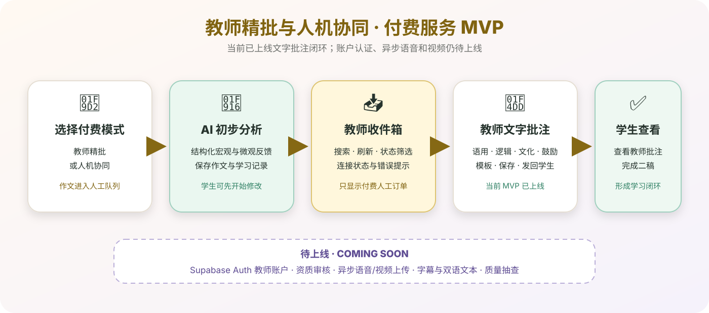

> **待上线 / Coming soon：**正式 Supabase Auth 教师账号、资质审核与接单权限、异步语音评价、视频总结、字幕和双语文本。早期版本不会开放教师与儿童私人视频通话。
>
> Production teacher accounts, credential-based order access, asynchronous audio feedback, video summaries, captions, and bilingual transcripts are coming soon. Early versions will not enable private live video calls between teachers and children.

### 全球认证教师网络（待上线）/ Verified global teacher network (Coming soon)

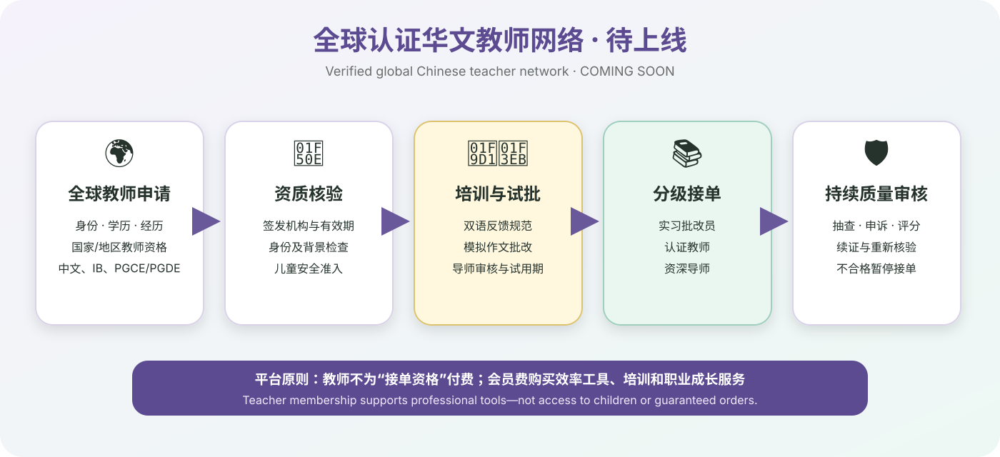

| 等级 / Level | 质量机制 / Quality control |
|---|---|
| 实习批改员 / Trainee reviewer | 完成培训与模拟测试；反馈由导师审核 / Training, simulation, and mentor approval |
| 认证教师 / Verified teacher | 身份与资质验证；随机质量抽查 / Identity and credential checks plus audits |
| 资深导师 / Senior mentor | 审核实习反馈、处理复杂作文与申诉 / Reviews trainees and handles complex cases |

### 全球教师准入资质 / Global teacher eligibility

红笔计划面向全球招募有资质的华文教师。申请者需要提交可验证的身份证明、学历、教学资质和相关教学经历；平台按签发机构和所在司法辖区核验，不以一张无法验证的“国际证书”自动替代正式教师资格。

HongBi plans to recruit qualified Chinese-language teachers worldwide. Applicants must provide verifiable identity, education, teaching credentials, and relevant experience. Each credential is reviewed according to its issuing body and jurisdiction; an unverifiable “international certificate” does not automatically replace a recognized teaching license.

可接受的资质示例包括：

- 中国或其他国家、地区认可的教师资格证，任教学科包含中文、华文、汉语或世界语言。
- 可核验的国际中文教育专业证书及相关学历、教学经历。
- 美国各州认可的教师执照，并具有中文、普通话或 World Languages 等相应任教授权。
- 英国或英联邦体系中的 PGCE/PGDE 等教师教育资质，并在适用时核验 QTS、注册状态或学校认可记录。
- IB 中文教师申请者需提供可验证的 IB 中文教学经历、课程经验及官方专业发展或培训记录；IB 培训记录与国家教师执照分别核验。
- 其他等效资质由平台人工审核，必要时要求试讲、模拟批改和背景调查。

Examples of eligible evidence include:

- A recognized national or regional teaching license covering Chinese, Mandarin, or world languages.
- Verifiable professional credentials in international Chinese-language education, supported by relevant education and teaching experience.
- A U.S. state teaching license with an appropriate Chinese, Mandarin, or World Languages authorization.
- A UK or Commonwealth PGCE/PGDE pathway, with QTS, registration, or recognized school evidence checked where applicable.
- For IB Chinese applicants, verifiable IB Chinese teaching experience, curriculum experience, and official professional-development records. IB training and national teacher licensure are reviewed separately.
- Equivalent qualifications subject to manual review, demonstration lessons, sample marking, and background checks where appropriate.

教师通过资质审核后仍需完成红笔的儿童安全培训、双语反馈规范、模拟批改和试用期质量观察，才能独立接受儿童作文订单。证件到期、投诉率异常或质量不达标时，平台可以暂停接单并重新审核。

Credential verification is only the first gate. Teachers must also complete HongBi child-safety training, bilingual-feedback standards, sample marking, and a monitored probation period before independently reviewing children's work. Expired credentials, abnormal complaint patterns, or quality failures can trigger suspension and re-verification.

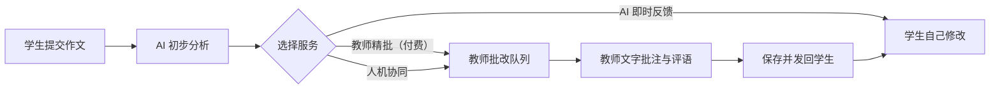

## 商业逻辑 / Business model

红笔不是单一“AI 批改器”，而是一条从低成本即时反馈到高价值专业教师服务的学习路径。

HongBi is not only an AI correction tool. It is a learning pathway that moves from low-cost instant feedback to higher-value professional teacher support.

### 核心客户与价值 / Customers and value

| 用户 / Customer | 核心需求 / Core need | 产品价值 / HongBi value |
|---|---|---|
| 6–12 岁二语儿童 / Child learners | 看懂原因、获得鼓励、愿意继续写 | 双语解释、拼音、小墨、菜园奖励 |
| 家长 / Parents | 在家也能支持孩子且看见进步 | 可理解的反馈、学习记录、安全控制 |
| HSK 学习者 / HSK learners | 模拟训练、失分原因、稳定提升 | 可选评分、双稿对比、错误档案 |
| 华文教师 / Chinese teachers | 提高批改效率、建立专业信誉 | AI 助手、模板、数据、认证与订单 |
| 学校与项目 / Schools and programs | 规模化写作练习与教学洞察 | 班级分析、教师管理、课程版本 |

### 会员、教师收入与抽成假设 / Membership, teacher pay, and take-rate hypotheses

> 价格需要通过早期用户访谈和付费实验验证。前三个月免费更适合作为限量“创始用户计划”，而不是永久承诺。

- **学生成长会员 / Learner Growth — US$29.90/month**：AI 写作练习、双语解释、拼音、一稿二稿对比、个人错误档案、儿童或 HSK 路径；试运营建议每月包含 **2 篇 300 字以内标准教师精批**，超出后按篇购买。真人额度不可无限使用。
- **教师专业会员 / Teacher Pro — US$9.90/month**：建议作为可选效率工具包，包含 AI 预分析、结构化模板、错误归档、个人主页和培训资源。**注册、资质审核和接单不应以付费为前提**；教师不能因为不购买会员就被降低基础稿酬。
- **真人批改 / Human review**：按篇、按额度包或会员附带额度收费；平台从完成并通过质量标准的订单中收取服务费。
- **机构方案 / School plans（待上线）**：按班级、教师席位或年度授权收费，提供班级分析、管理和隐私控制。

#### 建议的试运营按篇价格 / Suggested pilot per-essay pricing

按“中文字数 + 反馈深度”分档比单纯逐字计费更适合儿童作文。以下价格包含 AI 预分析、教师复核、结构化文字反馈和一次简短追问；教师完成一篇后获得固定稿酬，平台差额用于支付、客服、退款风险、AI 和质量审核。

Charging by Chinese-character band plus feedback depth is easier for families than a pure per-word rate. Each price includes AI pre-analysis, teacher review, structured written feedback, and one short follow-up.

| 作文字数 / Chinese characters | 学生单篇价 / Learner price | 认证教师收入 / Teacher payout | 建议用时 / Target time |
|---|---:|---:|---:|
| 150 字以内 / Up to 150 | US$7.90 | US$4.50 | 10–12 分钟 |
| 151–300 字 / 151–300 | US$11.90 | US$7.00 | 15–18 分钟 |
| 301–600 字 / 301–600 | US$18.90 | US$11.00 | 25–30 分钟 |
| 601–1,000 字 / 601–1,000 | US$29.90 | US$17.50 | 40–50 分钟 |

- 实习批改员由导师复核，建议获得相应认证教师稿酬的 60%–70%，导师另得 US$1.50–3.00 审核费。
- 资深教师、IB/AP/HSK 高阶写作可在基础稿酬上增加 20%–40%。
- 异步语音讲解建议学生加购 US$4.90，教师增加 US$3.00；视频总结待上线后建议加购 US$9.90，教师增加 US$6.00。
- 24 小时加急可加价 30%，其中至少 70% 的加急费支付给教师。
- 试运营目标不是追求最高平台抽成，而是保证教师有效时薪大致达到 US$22–30，并以真实完成时间、返工率和续费率每月调价。

这个目标时薪属于保守试点区间：Preply 当前列出的中文教师平均价格约为 US$23/小时，Wyzant 展示的中文家教常见价格约为 US$35–59/小时。红笔是异步、AI 辅助批改，不等同于一对一直播课，因此先以 US$22–30 的有效时薪验证供需，再根据教师所在地、资质、质量和留存调整。[Preply 中文教师价格](https://preply.com/en/online/chinese-tutors) · [Wyzant 中文教师价格](https://www.wyzant.com/Chinese_tutors.aspx)

### 商业飞轮 / Growth flywheel

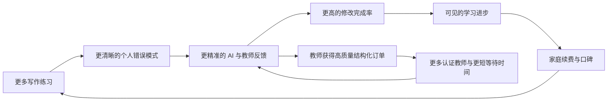

### 单位经济原则 / Unit-economics guardrails

- 免费期限制 AI 次数和真人批改额度，先验证留存与学习成效。
- 学生会员中的真人服务必须设置明确额度，避免人力成本失控。
- AI 先做结构化分析，教师聚焦高价值判断、语音讲解和鼓励。
- 教师收入、平台服务费、退款与质量申诉规则必须透明。
- 先从邀请制教师小规模试点，再扩展全球供给。

## 儿童安全与质量 / Child safety and quality

- 最小化教师可见的儿童真实身份信息 / Minimize child identity data shown to teachers.
- 家长可查看全部反馈与消息 / Give parents visibility into feedback and messages.
- 不允许交换私人联系方式 / Prevent exchange of private contact details.
- 提醒或隐藏作文中的学校、住址和联系方式 / Flag sensitive information in essays.
- 保留文字、语音和视频反馈审核记录 / Keep auditable feedback records.
- 实习教师反馈必须经导师审核 / Require mentor approval for trainee feedback.
- 家长可关闭社交与游戏化功能 / Let parents disable social and gamified features.
- 奖励真实学习行为，不制造限时焦虑 / Reward learning behavior without time-pressure mechanics.

## 技术流程 / Technical flow

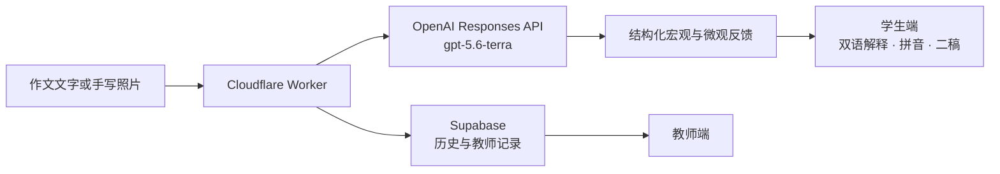

安全原则：`OPENAI_API_KEY` 只作为 Cloudflare Worker Secret 保存，绝不能写入 `worker.js`、`index.html` 或 GitHub。

Security rule: keep `OPENAI_API_KEY` only as an encrypted Cloudflare Worker secret. Never place it in source code or GitHub.

## 部署 / Deployment

1. 在 Cloudflare Dashboard 打开 `Workers & Pages`，选择现有 Worker。
2. 在 `Settings → Variables and Secrets` 添加 Secret：`OPENAI_API_KEY`。
3. 粘贴并部署本仓库中的 `worker.js`，保持 `index.html` 已使用的 Worker 地址不变。
4. 确认 CORS、OCR、三种反馈模式和 Supabase 记录正常。
5. 在 GitHub `Settings → Pages` 中使用 `main` 分支部署静态网页。

Wrangler 方式：

```bash
wrangler secret put OPENAI_API_KEY
wrangler deploy
```

## 路线图 / Roadmap

### Phase 1 — 双语 AI 写作教练 / Bilingual AI writing coach

- [x] 中英文错误原因 / Bilingual error explanations
- [x] 按需拼音 / On-demand pinyin
- [x] 具体表扬 / Specific praise
- [x] 儿童模式不评分 / Score-free child mode
- [x] 可选 HSK 模拟评分 / Optional HSK simulation
- [x] 小墨反馈提示 / Xiao Mo feedback hints
- [x] 本地种子与水滴 / Local seed and water rewards

### Phase 2 — 真人教师试点 / Human teacher pilot

- [ ] 邀请制认证教师 / Invite-only verified teachers
- [x] 教师端结构化文字批改框架 / Structured teacher text-review workflow
- [ ] 异步语音评价 / Asynchronous audio feedback
- [ ] 自动字幕与双语文本 / Transcripts and bilingual text
- [ ] 一稿、二稿与教师反馈历史 / Draft and teacher-feedback history

### Phase 3 — 教师平台与学习社区 / Teacher platform and community

- [ ] 实习教师与导师审核 / Trainee and mentor review
- [ ] 教师视频反馈 / Teacher video feedback
- [ ] Teacher Pro 专业会员
- [ ] 家长控制的好友菜园 / Parent-controlled friend gardens

### Phase 4 — 全球化与 HSK 深度训练 / Global and HSK expansion

- [ ] HSK 分级写作路径 / Level-specific HSK writing paths
- [ ] 简体与繁体 / Simplified and Traditional Chinese
- [ ] 多家庭语言解释 / More home-language explanations
- [ ] 多时区教师匹配 / Multi-time-zone teacher matching
- [ ] 学校与教育机构版本 / School and program plans

## 研究基础 / Research foundation

HongBi 的反馈设计源于 Grace Tang 在新加坡南洋理工大学的硕士论文研究：通过三组实验比较 AI、教师与人机协同对华文二语写作的反馈效果，并由此形成宏观与微观双层反馈框架。

HongBi's feedback design is informed by Grace Tang's M.A. thesis research at NTU Singapore: a three-group experimental study comparing AI-only, teacher-only, and human–AI collaborative feedback on second-language Chinese writing.

Earlier Claude-based research prototype: [`chinese-writing-feedback`](https://github.com/gracetang0925/chinese-writing-feedback)

## 学生端演示视频 / Learner demo video

这段 89 秒的真实产品录屏展示学生端写作流程、小墨互动、儿童成长模式、付费教师入口与 AI 反馈操作。演示使用虚构姓名和测试作文，不包含真实儿童资料。

This 89-second product walkthrough demonstrates the learner writing flow, Xiao Mo interaction, child growth mode, paid teacher options, and AI feedback. It uses a fictional name and test essay; no real child data is shown.

https://github.com/user-attachments/assets/1d4009e8-9b93-4771-a774-027b3b71ea76

## 关于 / About

Grace Tang 是华文教师和国际汉语教育研究者。HongBi 来自真实批改经验、数千篇作文，以及一个核心信念：反馈不仅要告诉学习者“改什么”，还要让他们理解“为什么”。

Grace Tang is a Chinese-language educator and researcher. HongBi grows from hands-on teaching experience and the belief that feedback should explain not only *what* to change, but *why*.

## License

MIT
